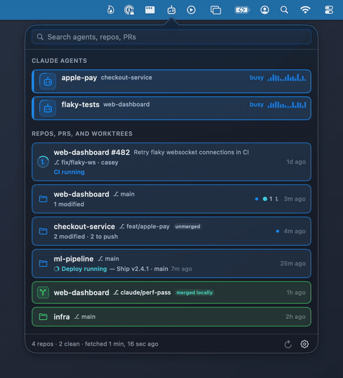

# Agents & Repos

*(binary and formula name: `agentsandrepos`)*



A macOS menubar app that gives you one place to see the endless onslaught of
info that agentic programming produces:

- **Claude Code agents** running on your machine — busy, **waiting on you**
  (with what they're waiting for, e.g. a permission prompt), or idle — mapped
  to the repo or worktree they're working in.
- **Local repos** across your project folders: branch, dirty/untracked counts,
  ahead/behind the remote. Clean repos stay out of the way; only what needs
  attention is listed.
- **Worktrees**, including the ones Claude Code creates for isolated work,
  nested under their parent repo.
- **Open GitHub PRs** per repo (yours by default, toggle for all) with a
  collapsed CI pass/fail/pending signal.
- Optional **auto-fetch** on a cadence, RepoBar-style: optionally fast-forwards
  repos that are clean and strictly behind. Never force-pushes, never resets,
  never touches a repo an active agent is using.
- **Live file watching** (FSEvents) over the project roots: new clones show up
  and repo status refreshes within seconds of a change; a push triggers an
  early PR check. The polling intervals below remain as a backstop for
  anything the filesystem can't signal.

The menubar icon shows the most urgent thing: `⏸N` agents waiting on you,
`⚙N` agents working, or the count of repos needing attention.

## Install

```sh
brew install --cask millisecond/tap/agentsandrepos
```

The cask installs a prebuilt, notarized `Agents & Repos.app` (no Xcode
needed), links the `agentsandrepos` CLI, and launches the app — look for the
new menubar icon. To start it at login, enable **Start at login** in the
app's Settings (a standard login item, visible in System Settings → General →
Login Items).

Heads up: the app phones home once a day to check for new releases; the
request carries a random install UUID and nothing else, and you can turn it
off in Settings — details under [Update check](#update-check) below.

Or from a checkout:

```sh
swift build -c release
.build/release/agentsandrepos &          # bare binary: no login-item support
packaging/make-app.sh && open "dist/Agents & Repos.app"   # full app bundle
```

## CLI

The same binary doubles as a terminal tool:

```sh
agentsandrepos snapshot            # one-shot overview of agents/repos/PRs
agentsandrepos snapshot --no-prs   # skip the GitHub lookup
```

## Configuration

`~/.config/agentsandrepos/config.json` (also editable from the Settings window):

```json
{
  "roots": ["~/Projects"],
  "scanDepth": 3,
  "fetchEnabled": true,
  "fetchIntervalMinutes": 5,
  "autoFastForward": false,
  "prScope": "mine",
  "prIntervalMinutes": 5,
  "statusIntervalSeconds": 45,
  "autoHideStaleDays": 30
}
```

`autoHideStaleDays` auto-hides repos with no activity (commits or edits to
changed files) for that many days; they move to the dashboard's Hidden list,
where a click un-hides them permanently (`staleExemptRepos`). Repos with
running agents or open PRs are never hidden, nor is a folder added directly
as a repo (staleness only applies when scanning a folder of repos), and 0
turns it off. Visible repo tiles sort by severity, then most recently touched.

- `roots` — folders scanned (depth-limited) for git repos; a root can also be a
  single repo.
- `autoFastForward` — off by default. When on, only repos that are clean, on a
  branch with an upstream, and strictly behind get `merge --ff-only`; repos
  with a busy/waiting agent are skipped.
- `prScope` — `"mine"` or `"all"`.

PR data comes from the [`gh` CLI](https://cli.github.com) using your existing
`gh auth login`; without it the PR section degrades to a hint.

Agent detection reads `~/.claude/sessions/*.json` (Claude Code's live session
records) and verifies each PID is actually alive, guarding against PID reuse.

## Uninstall

```sh
brew uninstall --cask agentsandrepos          # removes the app + CLI link
brew uninstall --zap --cask agentsandrepos    # …plus caches and preferences
```

Your configuration (roots, ignored repos, settings) lives in
`~/.config/agentsandrepos` — `--zap` removes that too; a plain uninstall
leaves it for a future reinstall.

## Update check

Once a day the app asks `api.agentsandrepos.com` for the latest release and
shows a banner when a newer version exists. The request carries a random
install UUID (`install_id`), generated on first launch and stored locally in
UserDefaults, used only to count installs — it contains no personal
information and is never derived from anything on the machine. If the check
fails for any reason it does so silently and no banner appears. Turn the
check off entirely with **Check for updates daily** in Settings.

## CPU self-check

A background app should cost nothing while you're not looking at it, so the
app watches its own CPU use (one `getrusage` call every 30 seconds). If its
5-minute average stays above ~15% of a core — normal is around 1% — a red
banner appears at the top of the dashboard with the measured average.
Restarting the app clears it; if it comes back, please open an issue. Warn and
clear events are also written to the unified log (subsystem
`com.millisecond.agentsandrepos`, category `perf`):

```sh
/usr/bin/log show --last 1h --predicate 'subsystem == "com.millisecond.agentsandrepos" AND category == "perf"'
```

## Publishing checklist (maintainer)

1. Bump `Version.current` in `Sources/AgentsAndReposCore/Version.swift` to
   match the tag (the in-app update banner compares it against the latest
   release advertised by `api.agentsandrepos.com`, which relays this repo's
   latest GitHub release), commit, then `git tag vX.Y.Z && git push --tags`.
2. Quit the running app, then `packaging/make-app.sh` — builds, signs,
   notarizes, and staples `dist/agentsandrepos-<version>.zip`, printing its
   sha256 (needs the `agentsandrepos-notary` keychain profile).
3. `gh release create vX.Y.Z dist/agentsandrepos-X.Y.Z.zip`
4. In the tap repo (`millisecond/homebrew-tap`), edit `version` and `sha256`
   in `Casks/agentsandrepos.rb` **in place** — don't copy
   `packaging/agentsandrepos.rb` over it; that file keeps a placeholder
   sha256. Push the tap.

## Requirements

- macOS 14+
- Xcode toolchain only to build from source (the cask ships a prebuilt,
  Developer ID-signed and notarized app)

## AI full disclosure

This software is developed with **strong assistance from Claude Fable 5**
(via Claude Code), with a human leading the ideas, design decisions, testing,
and debugging. Fittingly, the app itself exists to watch Claude agents work —
so it was largely built by the kind of agent it monitors.
